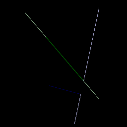
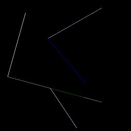
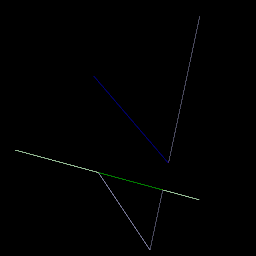
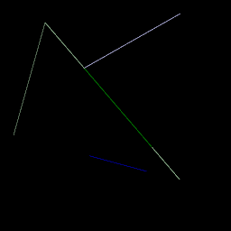

# SimpleDiffRender.jl

A Julia port of [Tzu-Mao Li's diffrender_tutorials](https://github.com/BachiLi/diffrender_tutorials)  
It is a small 2D renderer that incorporates ideas from Tzu-Mao Li's paper on [differentiable ray tracing with edge sampling](https://cseweb.ucsd.edu/~tzli/diffrt/). An in depth code walkthrough can be found in the SIGGRAPH 2020 course on [Physics-Based Differentiable Rendering](https://shuangz.com/courses/pbdr-course-sg20/).  
Images shown are of the conventional rendering and and renderings of the screen coordinate derivatives, captured with the edge sampling technique.  
  
| Derivatives in -x and -y direction | Derivatives in x and y direction |
:-------------------------:|:-------------------------:
|  |  |  
|  |  |  
